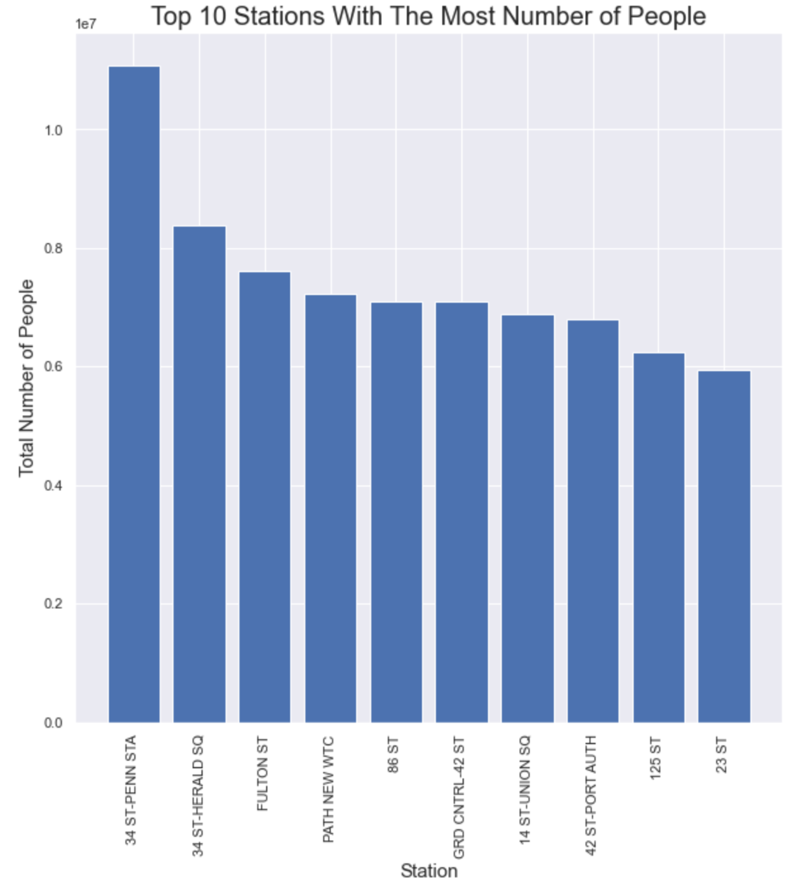

## Analysis of the Metropolitan Transportation Authority (MTA) Turnstile Data  

The goal of this project is to analyze the MTA Turnstile Data to see which stations have a lot of people to help the Café chain to determine the places where it will open new branches.

To start exploring this goal, I will sum the DAILY ENTRIES and DAILY_EXITS to find the total number of people that have passed through the station.

The figure depicts the top 10 stations that have the most people.

This result shows that the top 3 stations with the most people are: 34 ST-PENN STA, 34 ST-HERALD SQ, FULTON ST.